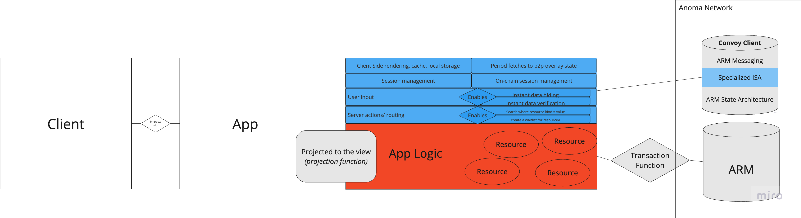

# Architecture

The Convoy is designed to run on top of the Anoma interface for cross-chain settlement, intent creation, and concurrent state creation.&#x20;

With this design, developers can build any blockchain-based capabilities for any chain.&#x20;

<figure><figcaption></figcaption></figure>
